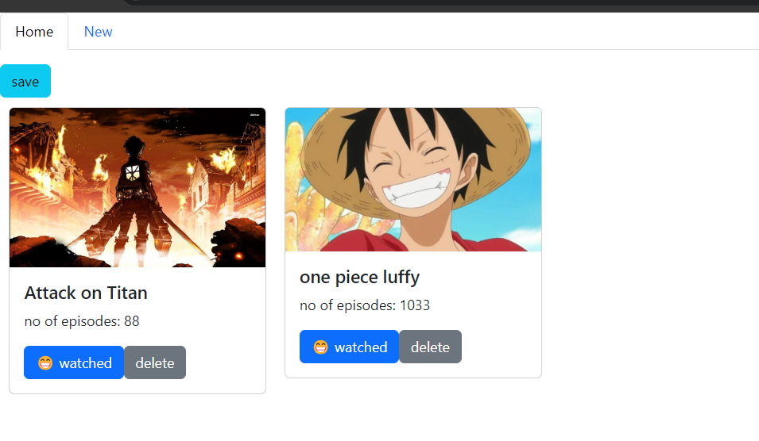

# A simple application to store the anime you like

## the view of application



## The file structure

```bash

📁 src
\
|   App.css  
|   📝 App.jsx  
|   📝 firebase.js            
|   index.css
|   main.jsx
|   
+---assets
|       react.svg
|       
\---components
        📝 Dashboard.jsx
        📝 MyCard.jsx
        📝 New.jsx

```

## pre-requisite

- install some required packages.
- `npm install bootstrap bootstrap-react`
- `npm install formik`
- below are related to firebase...
- `npm install firebase`  
- `npm install -g firebase-tools`

## The files and its code

### `App.jsx`

```jsx
import 'bootstrap/dist/css/bootstrap.min.css';
import Dashboard from './components/Dashboard';

export default function App() {
  return (
    <Dashboard />
  )
}
```

### `Dashboard.jsx`

```jsx
import { useEffect, useState } from 'react';
import Tab from 'react-bootstrap/Tab';
import Tabs from 'react-bootstrap/Tabs';
import New from './New';
import MyCard from './MyCard';
import db from '../firebase';
import { collection, deleteDoc, doc, getDocs, setDoc } from 'firebase/firestore';
import { Button } from 'react-bootstrap';

const COLLECTION_NAME = "animes";

export default function Dashboard() {
    const [key, setKey] = useState('home');
    const [animeList, setAnimeList] = useState([]);

    useEffect(() => {
        async function getData() {
            const querySnapShot = await getDocs(collection(db, "animes"))
            const result = [];
            querySnapShot.forEach((doc) => {
                result.push(doc.data());
            });
            setAnimeList(result);
        }
        getData();
    }, []);

    // Function to add new anime to the list
    const addAnime = (newAnime) => {
        setAnimeList([...animeList, newAnime]);
    };

    const handleSaveBtn = async () => {
        try {

            for (let i = 0; i < animeList.length; i++) {
                const anime = animeList[i];
                await setDoc(doc(db, 'animes', anime.name), {
                    ...anime
                });
            }
            alert("data saved successfully");
        } catch (error) {
            alert("some thing went wrong...");
        }
    }

    const deleteCard = async (doc_id) => {
        try {
            await deleteDoc(doc(db, 'animes', doc_id));
            async function getData() {
                const querySnapShot = await getDocs(collection(db, "animes"))
                const result = [];
                querySnapShot.forEach((doc) => {
                    result.push(doc.data());
                });
                setAnimeList(result);
            }
            getData();
        } catch (error) {
            alert("some thing went wrong");
        }
    }

    return (
        <>
            <Tabs
                id="controlled-tab-example"
                activeKey={key}
                onSelect={(k) => setKey(k)}
                className="mb-3"
            >

                <Tab eventKey="home" title="Home">
                    <div>
                        <Button variant='info' onClick={handleSaveBtn}>save</Button>
                    </div>
                    {animeList.map((anime, index) => (
                        <MyCard
                            key={index}
                            imageUrl={anime.imageUrl}
                            name={anime.name}
                            episodes={anime.episodes}
                            watched={anime.watched}
                            onDelete={deleteCard}
                        />
                    ))}
                </Tab>
                <Tab eventKey="new" title="New">
                    {/* Pass addAnime function to New component */}
                    <New addAnime={addAnime} />
                </Tab>
            </Tabs>
        </>
    );
}
```

### `MyCard.jsx`

```jsx
import Button from 'react-bootstrap/Button';
import Card from 'react-bootstrap/Card';

export default function MyCard({ imageUrl, name, episodes, watched, onDelete }) {
    return (
        <Card style={{ width: '18rem', float: 'left', margin: '10px' }}>
            <Card.Img variant="top" src={imageUrl} />
            <Card.Body>
                <Card.Title>{name}</Card.Title>
                <Card.Text>
                    no of episodes: {episodes}
                </Card.Text>
                <Button variant="primary">
                    {watched ? "😁 watched" : "🤔😔💭 not yet watched"}
                </Button>
                <Button variant="secondary" onClick={() => onDelete(name)}>
                    delete
                </Button>
            </Card.Body>
        </Card>
    );
}

```

### `New.jsx`

```jsx
import React from "react";
import { Formik } from "formik";
import { Form, Button, Container } from "react-bootstrap";

export default function New({ addAnime }) {
    return (
        <Container className="mt-5">
            <h2>Anime Details Form</h2>
            <Formik
                initialValues={{
                    imageUrl: "",
                    name: "",
                    episodes: "",
                    watched: false,
                }}
                onSubmit={(values) => {
                    // Call the addAnime function to update the list
                    addAnime(values);
                    alert("Form submitted successfully!");
                }}
            >
                {({
                    values,
                    handleChange,
                    handleSubmit,
                    setFieldValue,
                }) => (
                    <Form onSubmit={handleSubmit}>
                        {/* Image URL Field */}
                        <Form.Group controlId="imageUrl">
                            <Form.Label>Image URL</Form.Label>
                            <Form.Control
                                type="text"
                                name="imageUrl"
                                placeholder="Enter image URL"
                                value={values.imageUrl}
                                onChange={handleChange}
                            />
                        </Form.Group>

                        {/* Anime Name Field */}
                        <Form.Group controlId="name">
                            <Form.Label>Anime Name</Form.Label>
                            <Form.Control
                                type="text"
                                name="name"
                                placeholder="Enter anime name"
                                value={values.name}
                                onChange={handleChange}
                            />
                        </Form.Group>

                        {/* Number of Episodes Field */}
                        <Form.Group controlId="episodes">
                            <Form.Label>Episodes</Form.Label>
                            <Form.Control
                                type="number"
                                name="episodes"
                                placeholder="Enter number of episodes"
                                value={values.episodes}
                                onChange={handleChange}
                            />
                        </Form.Group>

                        {/* Watched Checkbox */}
                        <Form.Group controlId="watched">
                            <Form.Check
                                type="checkbox"
                                name="watched"
                                label="Already watched"
                                checked={values.watched}
                                onChange={(e) => setFieldValue("watched", e.target.checked)}
                            />
                        </Form.Group>

                        {/* Submit Button */}
                        <Button variant="primary" type="submit" className="mt-3">
                            Submit
                        </Button>
                    </Form>
                )}
            </Formik>
        </Container>
    );
}

```

### firebase.js

```javascript
// Import the functions you need from the SDKs you need
import { initializeApp } from "firebase/app";
import { getFirestore } from "firebase/firestore";

// TODO: Add SDKs for Firebase products that you want to use
// https://firebase.google.com/docs/web/setup#available-libraries

// Your web app's Firebase configuration
// For Firebase JS SDK v7.20.0 and later, measurementId is optional
// 💡REPLACE BELOW CONFIG WITH YOUR CONFIG 💡
// 👇👇👇👇👇👇👇👇👇👇👇👇👇👇👇👇👇👇👇👇👇👇👇 
const firebaseConfig = {
    apiKey: "",
    authDomain: "",
    projectId: "",
    storageBucket: "",
    messagingSenderId: "",
    appId: "",
    measurementId: ""
};

// Initialize Firebase
const app = initializeApp(firebaseConfig);
const db = getFirestore(app);
export default db;
```
